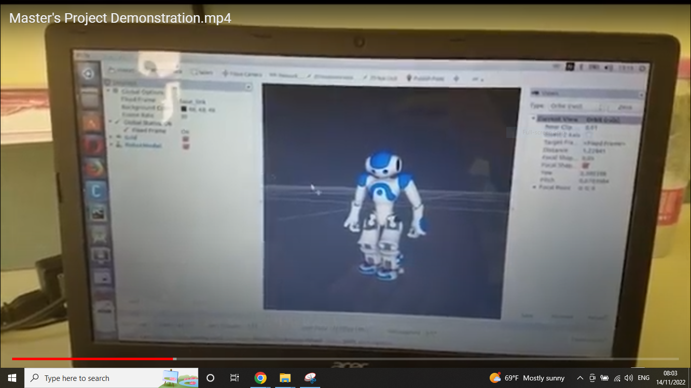
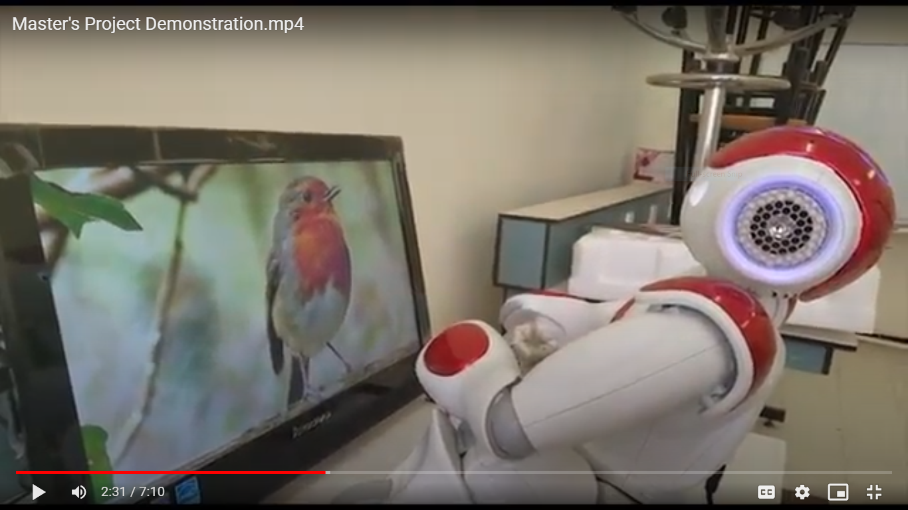
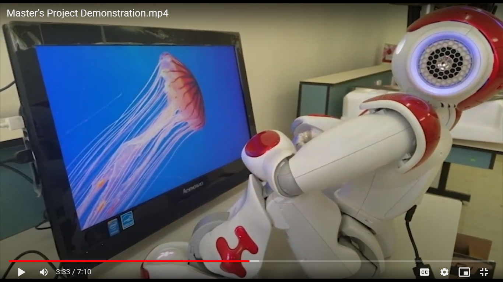
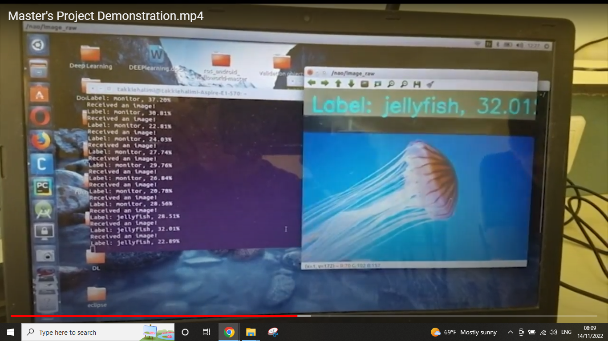
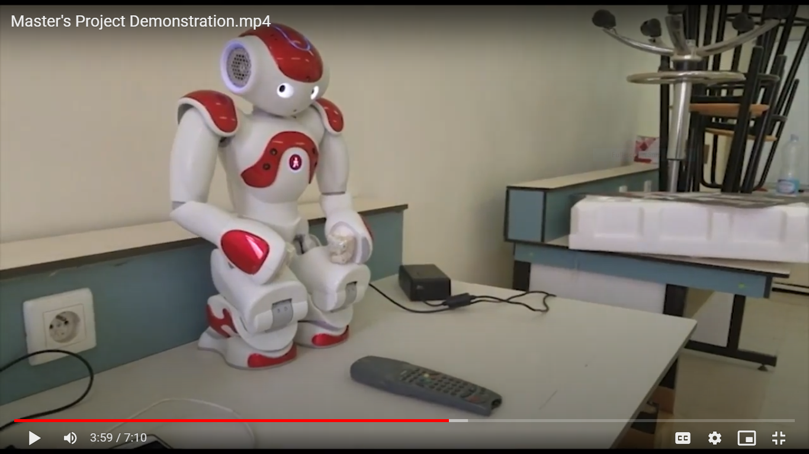
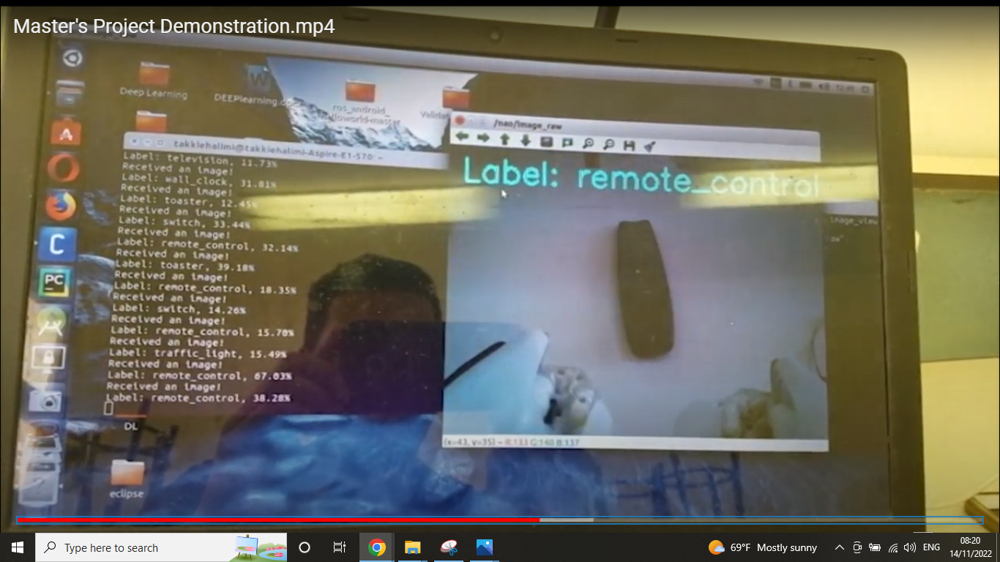

# Visual Perception Enhancement of NAO Robot Using Deep Learning Model Based Object Recognition.

Perception enhencement using ROS and deep convolutional neural network model  based object recognition for the NAO Robot.

# Pre-requisites
- Python 2 
- Rviz (comes pre-installed with ros-desktop-full)
- [NAO Robot simulation package](http://wiki.ros.org/nao.git)
# Installation

Install ROS and ROS dependencies under Ubuntu
Install TensorFlow, Keras frameworks

## Usage

```PHP

# -----------------------------------------------------------------------------------
# Access to the sensor of the NAO robot camera retrieve a sequence.
# Retrieve a sequence of images and convert them into an OpenCV images.
# Pass them to the trained model for prediction.
# -----------------------------------------------------------------------------------

#!/usr/bin/env python

import numpy as np
import rospy
from sensor_msgs.msg import Image
from cv_bridge import CvBridge, CvBridgeError

from keras.models import load_model
import dill as pickle
import tensorflow as tf

import cv2
bridge = CvBridge()

model = load_model('FM.h5')
model.compile(optimizer='adam',loss='categorical_crossentropy',metrics=['accuracy'])
graph = tf.get_default_graph()
rospy.init_node('classify', anonymous=True)


def callback(msg):
    #First convert the image to OpenCV image 
    print("Received an image!")

    label_list_path = 'batches.meta'
    with open(label_list_path, mode='rb') as f:
       labels = pickle.load(f)

    cv2_img = bridge.imgmsg_to_cv2(msg,"bgr8")
    img = cv2.resize(cv2_img,(32,32))
    img = np.reshape(img,[3,32,32])
    img = np.expand_dims(img, axis=0) 
    
    global graph
    with graph.as_default():
       pred = model.predict(img)
       pred = labels["label_names"][np.argmax(pred)]
       print('class : ''|',pred,'|')  

rospy.Subscriber("/nao_robot/camera/top/camera/image_raw", Image, callback, queue_size = 1, buff_size = 16777216)

while not rospy.is_shutdown():
  rospy.spin() 

```
## Demo
Run launch commands.

     Set ROS with the Robot using Ubuntu terminal commands

     export NAO_IP= IP_ADRESS_OF_ROBOT
     ROS_MASTER_URI= IP_ADRESS_OF_ROS_MASTER
     roslaunch nao_bringup nao_full_py.launch force_python:true



Run test command

     roslaunch py model.py
     rosrun image_view image_view image:=/nao/image_raw


Test on virtual objects




Test on real objects




# Note
This is implemented on Ubuntu 16.04 LTS, ROS 1 version kinetic.

# Reference
1. http://wiki.ros.org/ROS/Tutorials
2. https://github.com/ros-visualization/rviz.git
